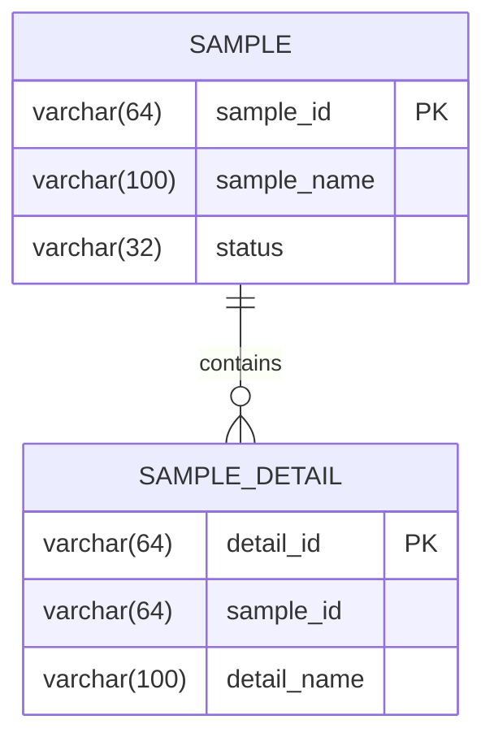
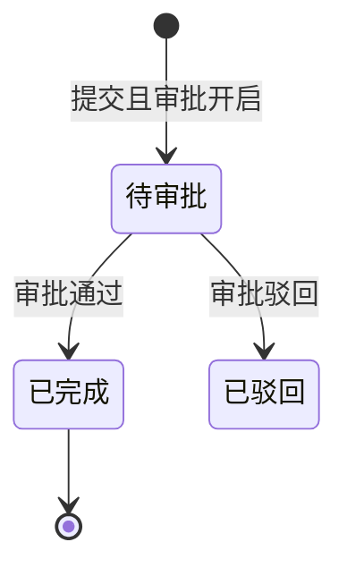
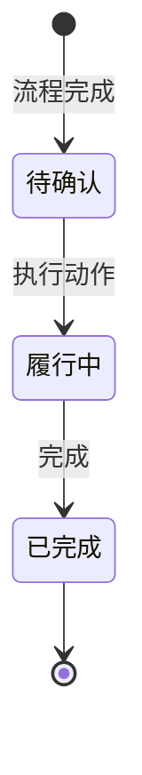
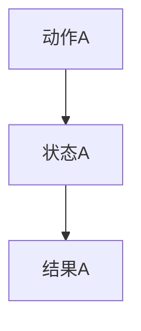
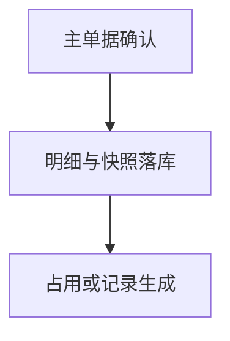
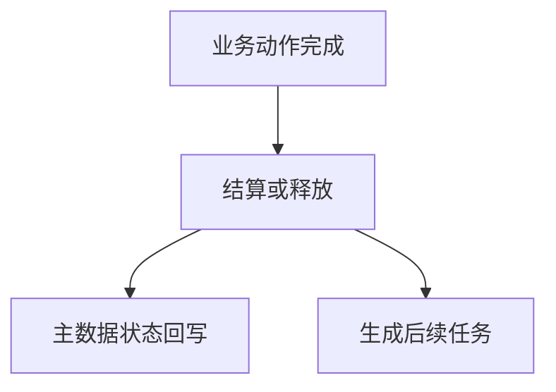
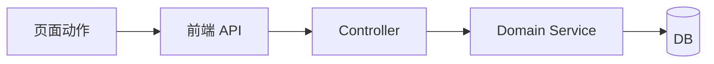
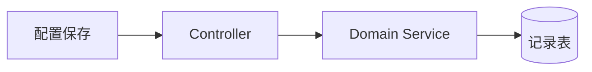

# ER图



# 增量SQL

```sql
-- 建表只保留主键（含复合主键），不建立外键、UNIQUE 唯一键及其他索引；
-- 业务唯一性/幂等由服务层+事务锁保证，需 DB 级兜底时写入文末“待确认与需求冲突”段。
-- 注释约定：表级 COMMENT 说明表用途；业务字段用列级 COMMENT 说明作用/取值；主键与审计字段（create_user_id/create_time/update_user_id/update_time）不写列注释。
CREATE TABLE sample_detail (
  detail_id varchar(64) NOT NULL,
  sample_id varchar(64) NOT NULL COMMENT '关联主单据ID',
  status varchar(16) NOT NULL DEFAULT 'NEW' COMMENT '状态：NEW 新建/APPROVED 已通过/REJECTED 已驳回',
  amount decimal(18,2) DEFAULT NULL COMMENT '金额（元，保留两位小数）',
  create_user_id varchar(64) NOT NULL,
  create_time datetime NOT NULL,
  PRIMARY KEY (detail_id)
) ENGINE=InnoDB DEFAULT CHARSET=utf8mb4 COMMENT='示例明细表：记录主单据下的明细与状态';
```

## 流程引擎实体与状态机实现边界

> 本段固定放在增量 SQL 代码块后、业务流程图前，不新增一级标题。只有具备明确审批生命周期的实体才创建流程实例；普通业务状态不得因存在 `status` 字段而接入流程引擎。

| 实体/对象 | 实现方式 | 流程引擎职责 | 状态机或联动职责 | 关键字段/约束 |
| --- | --- | --- | --- | --- |
| 示例审批单 | 流程引擎 + 业务状态机 | 审批开启时创建实例；同步待审批/通过/驳回/撤回/终止 | 审批通过后管理待履约/履约中/已完成 | 流程实例ID与流程状态、业务状态分离；免审批不创建实例 |
| 示例任务 | 纯状态机 | 不创建流程实例 | 按动作与前置条件推进任务状态 | 仅保存任务状态 |
| 示例记录 | 联动投影 | 不创建流程实例 | 随主业务动作同步过滤/排序字段 | 业务事实以主单据为准 |
| 外部单据 | 外部复用 | 遵循外部领域既有流程实现 | 本模块只发起或保存来源关联 | 不复制外部流程与状态机 |

# 业务流程图

> 有状态对象时，每个状态机使用独立二级标题和独立 `stateDiagram`；图后必须紧跟关键补充说明。共享状态机只画一次，并说明复用实体。
> 同一业务事实只用一个状态字段；“尚未发生”用空值表达、页面显示 `-`，该展示值不落库。
> 图中只由其他任务状态或时间字段推导展示的中间过程节点，必须在图后说明标注“过程叙述节点，不落库”并写清推导来源。
> Mermaid 标签避免未加引号的 ASCII 括号、竖线与冒号；交付前必须通过 `scripts/check-mermaid.py` 校验（真实渲染或结构化 lint）。

## 示例审批单状态机



- 状态归属：说明状态字段、是否落库以及由流程引擎还是业务状态机维护。
- 关键触发：说明提交、审批回调及状态前置条件。
- 终态与联动：说明终态、异常限制以及触发的业务联动。

## 示例任务状态机



- 状态归属：说明任务状态的存储实体与维护职责。
- 关键触发：说明各转换动作及前置条件。
- 终态与联动：说明完成后的跨实体同步和不可逆限制。
- 叙述节点：说明图中哪些节点不落库、由什么推导展示（无则写“无”）。

> 若多实体共用同一状态机（如多类单据共用审批流程），写明“复用：审批流程状态机”，不重复画同图。
> 新增状态或终态时，必须在图后说明中补：触发方与动作、写入的时间字段、是否不可逆、进入后必须拒绝的接口、历史数据是否回填。

## 主流程一（按流程分段，不合并成一张总图）



## 实体间联动触发关系（按链路分段，每链路独立成图）





# 数据流转图

> 每条链路标明模块归属、跨服务方向与事务/异步边界；只画本次涉及的链路，不画全量系统图。

## 数据链路一



- 模块与依赖：说明所属 application 与 common 模块，是否复用既有服务
- 事务与异常：说明事务边界、失败回滚和幂等控制点

## 数据链路二



- 模块与依赖：说明归属模块；涉及外部系统时标注调用方向
- 事务与异常：说明超时、失败处理与补偿方式（无则写“无外部依赖”）

# 接口清单

## SampleController（`/sample`）

### list

- 后端 URL：`/admin/sample/list`
- Method：`POST`
- Controller：`SampleController`
- 请求参数（复杂查询沿用 `@MyRequestBody` 组合入参；同构接口后续可“其余同 list”）

| 字段名 | 类型 | 必填 | 字段含义 | 字典编码 |
| --- | --- | --- | --- | --- |
| filter.status | String | 否 | 状态筛选 | `sample_status` |
| pageParam.current | Integer | 是 | 当前页 | - |
| pageParam.size | Integer | 是 | 每页条数，最大 50 | - |

- 响应参数：`ResponseResult<MyPageData<SampleVo>>`

| 字段名 | 类型 | 必填 | 字段含义 | 字典编码 |
| --- | --- | --- | --- | --- |
| rows[].id | String | 是 | 主键 | - |
| rows[].status | String | 是 | 状态 | `sample_status` |
| total | Long | 是 | 总条数 | - |

- 备注：
  - 权限与数据范围：`@SaCheckPermission("sample.list")`；按租户过滤，院区/组织范围取自登录上下文
  - 状态与一致性：只读接口，无状态变更
  - 性能边界：分页必填，`pageParam.size` 上限 50；`status` 过滤与 `create_time` 排序的索引需求见待确认项
  - 最小测试：正向—按状态筛选返回分页数据；负例—pageSize 超上限被拒绝

### detail

- 后端 URL：`/admin/sample/detail`
- Method：`POST`
- Controller：`SampleController`
- 请求参数：`sampleId`（String，必填）
- 响应参数：`ResponseResult<SampleVo>`
- 备注：
  - 权限与数据范围：需登录；详情按租户和业务归属校验，跨归属返回无权限
  - 最小测试：正向—存在且归属正确；负例—传入其他租户或已删除 ID

# 增量字典

## 实体字段字典使用清单

| 实体 | 字段 | 字典编码 | 字典名称 | 字典类型 |
| --- | --- | --- | --- | --- |
| `sample_order` | `status` | `SampleOrderStatus` | 示例单据状态 | 常量字典 |
| `sample_order` | `category_id` | `assetUseCategory` | 示例分类 | 全局字典 |
| `sample_order` | `purpose` | `SamplePurpose` | 示例用途 | 自定义字典 |

> 逐字段说明使用哪个字典编码；引用 UPMS 组织、人员、班组等外部主数据、仅经 `xxxDictMap` 回填名称的字段不列入本表。

## 字典枚举项

每个字典编码一个三级标题和一个表格，列出该字典下的全部字典项。

### SampleOrderStatus（示例单据状态）

| 字典项编码 | 字典项名称 | 说明 |
| --- | --- | --- |
| `PENDING` | 待处理 | 已提交，待处理 |
| `COMPLETED` | 已完成 | 终态 |

### assetUseCategory（示例分类）

| 字典项编码 | 字典项名称 | 说明 |
| --- | --- | --- |
| 平台动态项 | 分类项 | 复用平台既有字典，字典项由来源域维护，实现时以实际字典为准 |

### SamplePurpose（示例用途）

| 字典项编码 | 字典项名称 | 说明 |
| --- | --- | --- |
| `PURPOSE_A` | 用途A | - |
| `PURPOSE_B` | 用途B | - |

> 字典类型只允许常量字典、全局字典、自定义字典。单据状态及稳定业务枚举使用常量字典；跨域字典必须直接复用平台既有编码（如 `assetUseCategory`、`EnabledStatusDict`），不得另造同义编码；本模块新增编码沿用“模块前缀 + 业务名”风格，编码未确认时标注待分配。不要在本章写 DictMap、页面使用位置、派生展示状态、非字典布尔项或算法说明。

## 待确认与需求冲突

> 本段不计入一级章节；合并同类问题，按短表格或短条目输出，不重复正文说明。

| 问题 | 影响 | 责任方/所需输入 |
| --- | --- | --- |
| PRD 两处口径不一致（示例：起算时点） | 状态机节点、SQL 取值、接口前置校验 | 产品确认采用口径 |
| 原型旧口径残留（示例：旧字段/旧算法） | 仅作清理项，不作为生效设计 | 产品/前端确认可清理 |
| 真实项目路径未提供 | 模块归属与复用判断为建议稿 | 后端提供路径 |
| 真实库 schema 未核对 | 建表、迁移与历史回填待确认 | 后端/DBA 提供结构 |
| 自定义字典编码未分配 | 接口与字典编码待定 | 后端确认编码 |
| 过滤/排序字段索引需求未裁决 | 大数据量下查询性能 | 后端/DBA 按查询场景确认 |
